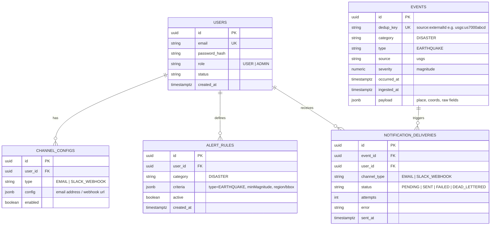
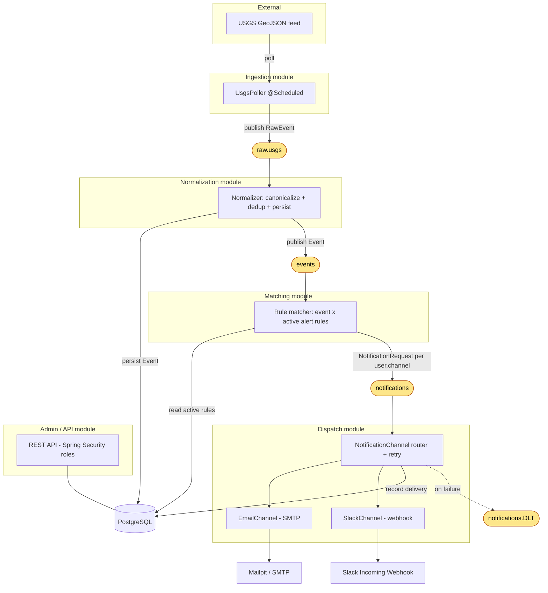
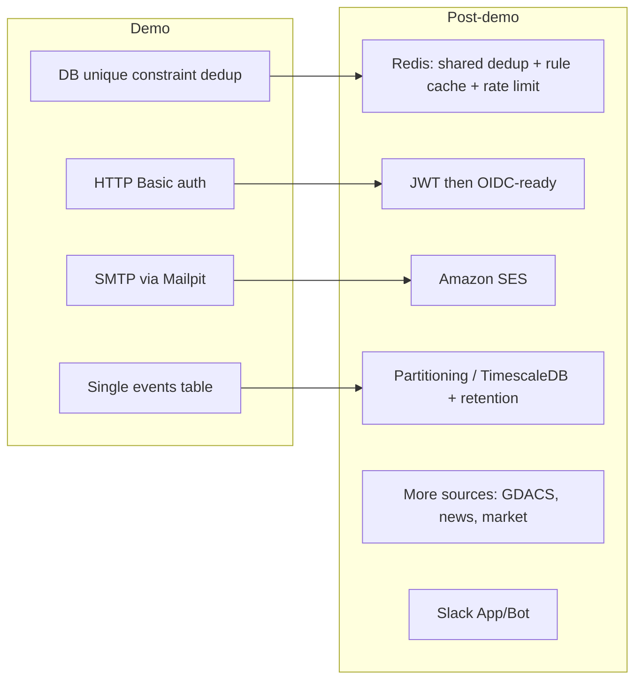

# Alert Platform — Diagrams

Visual companion to [`DESIGN.md`](./DESIGN.md). Diagrams use [Mermaid](https://mermaid.js.org/) and render in GitHub, IntelliJ, and most Markdown viewers. Reflects the demo scope (USGS earthquakes → email + Slack).

---

## 1. Data model (ER diagram)

Notes:
- `dedup_key` unique constraint is the sole dedup guard for the demo (DESIGN §12.2).
- `config` and `criteria` are `JSONB` so channels and rule types extend without schema migrations.
- `sources` table is deferred; the demo hardcodes the USGS poller config.

---

## 2. System architecture & event flow

Yellow nodes are Kafka topics. Per-source raw topics (`raw.<source>`) converge to the single normalized `events` topic; matching and dispatch are source-agnostic (DESIGN §4).

---

## 3. Deferred / post-demo (for context)

